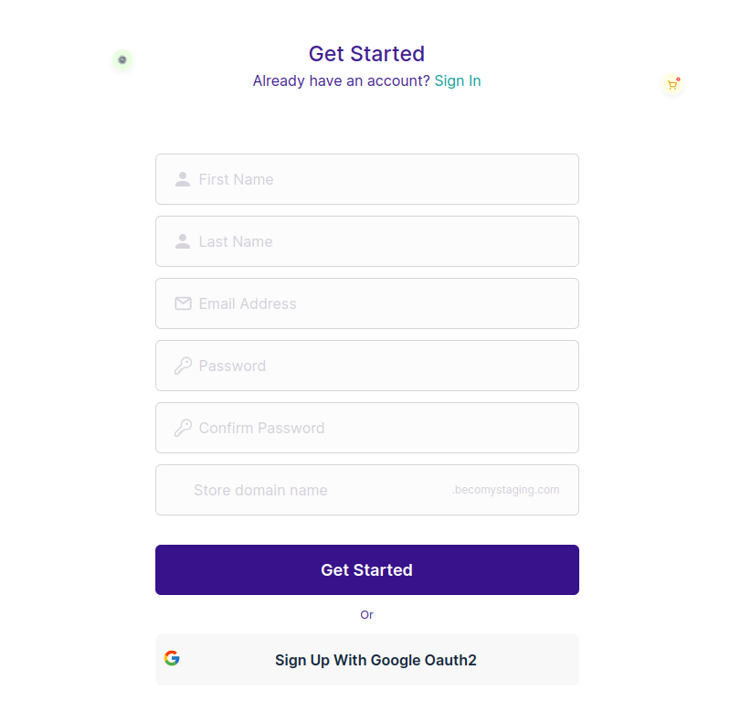

### Ready, Set, Go!

Alright, let’s kick things off and get you started with Becomy. Before you can dive into the e-commerce awesomeness, let’s make sure you’re set up and ready to roll.

### System Requirements

No rocket science here – just make sure your computer or device and internet connection are in good shape. Becomy plays well with most setups, so you don’t need a supercomputer to get things done.

### Registration and Account Setup

Time to claim your spot in the Becomy family. Head to our website, hit that “Sign Up” button, and follow the friendly prompts. We'll need some basic info from you, but don’t worry, it's like creating a social media account – quick and painless.

### Step-by-Step:

**Fill in Your Details:**

1. Click on [**"Sign Up"**](https://becomystaging.com/admin_users/sign_up) at the top right corner of the website.
2. Provide your `first name`, `last name`, `email`, `store domain name`, and choose a `password` that's easy to remember but tough to crack.
3. **Verify Your Account:** Keep an eye on your inbox – you'll receive a snappy account verification email.
4. Open the email and hit that **"Verify"** button. Voila! You're officially a Becomy buddy.

You can also sign up quickly by using your `Google account`. Just click on the `Sign up with Google` button on the signup page and follow the simple steps to link your Google credentials.

:::warning

Make sure to save your _**store name**_ somewhere safe.

:::
