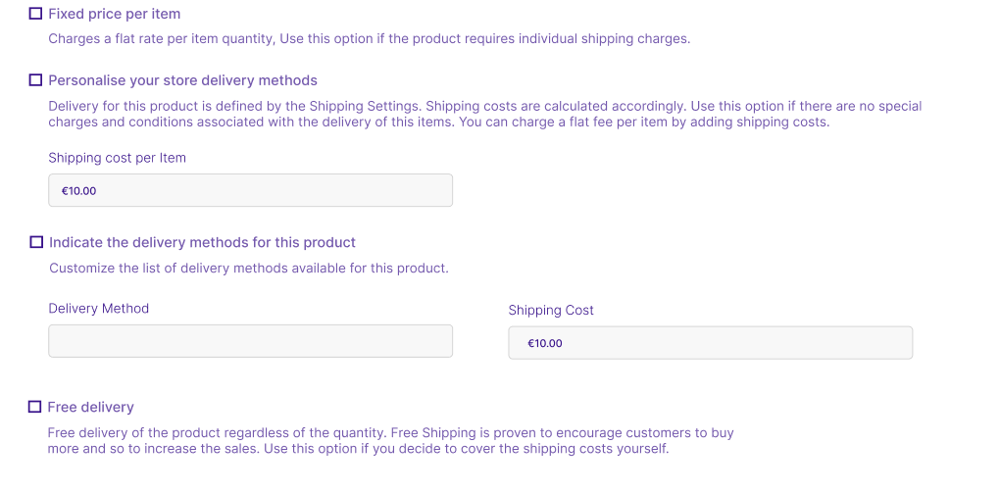

<head>
<meta property="twitter:description" content="Get insights into title, description, product media, and variants management on our product details page for a complete overview."/>
<meta property="twitter:title" content="Product details | Becomy"/>
<meta property="og:url" content="https://docs-becomy.surge.sh/products/details/"/>
<link rel="canonical" href="https://docs-becomy.surge.sh/products"/>
<link rel="alternate" href="https://docs-becomy.surge.sh/products/fr" hreflang="fr"/>
</head>

## Guide to Product Details

You can easily manage your products and help customers find what they're looking for by sharing information about them that directly affects how they appear to them. You do not have to provide every detail about your product.
To create a product, you must provide the necessary information such as the title, description, and submit product photos. You must include information that makes your product easier for your customers to understand. Add the price, any variations, weight, and shipping information.  
To update photos for product variants, navigate to the variant section of the product page. After creating the product, go to the relevant product page in the product list and update the variant images. 
This allows for easy customization and management of variant images, ensuring each variant has a distinct visual representation.

### Title and Description

- **Title**: The name you want to display for your product. You can include the crucial information about the product to make 
it easier for customers to understand.

- **Description**: Descripiton of your product. Focus on product advantages, highlight product
features and list it's charactestics. You may also use animated elements, images to to help describe your product.
Description section uses the [rich text editor](#), so you can easily use bullet points, numbered list, paragraphs, links, or additional images.

:::tip

Avoid using manufacturer's exact descriptions for uniqueness in search engines. Visit [Rich text Editory](#) from more details.

:::

### Media

Include images, 3D models, and videos to showcase your product. Refer to [Product Media](#) for detailed information.

### Pricing

You can setup prices for product variations and individual products. Establishing prices for products involves calculating production costs,
adding desired profits, and considering market demand. Competitive analysis ensures pricing aligns with industry standards, while strategic discounts and 
bundling options can enhance sales and customer appeal.

- **Price**: Set the product price in your store's currency.
- **Compare-at Price**: It is the actual or original price product is sold for.
To set the **Compare at Price** for the product    
    1. From you Becomy Admin, go to **Catalog -> Products** 
    2. View the Product you want to set **Compare at Price for**.
    3. Scroll to the Pricing Section.
    4. Set the price in the **Compare at Price** input field. The value must be higher than the value in the **Pricing** field.
      
      
    
    5. Save the changes. 
- **Cost per Item**: Optional field for production cost. Displays projected margin.
      
      

### Inventory
Inventory is the amount of products available for sale

It is crucial to keep track of your products in your inventory so that you don't sell more than you actually have. It helps
you to remind to restore your stock before it runs out, and also shows the available products to your customers.

#### SKU
SKU (Stock Keeping Unit) a code for product identification within your business. For effective tracking of products, each sku needs to be matchless.
It's either your own mix of letters or numbers or is provided by manugfacturer. SKU field is optional, if it's empty product won't be having any SKU, but if you add SKU then it must be unique.

:::info
If you want to sell product with multiple variations, you can add SKUs for each variation
:::

#### Barcode 
Barcode (GTIN, ISBN, UPC ) is a special codes to show information about products. This code helps, quickly identifying and tracking products, making inventory management easy.  
It could be new or exsiting global trade item number, which are used globally to identify products. Depending on the product GTIN, ISBN and UPC can vary in length.
Please, do not write false barcode for your products.

If you don't have barcode for the product, then you can get it from manufacturer. Identify how to get GTIN of your product from manufacturer at [GS1 Standard Website <Icon icon="fa-solid fa-arrow-up-right-from-square" />](https://www.gs1.org/standards/barcodes)
:::info
  You can add Barcode for each variation of product separatly
:::

#### Warehouse Location and Availablility
  The **Available** field indicates the quantity of a product in your stock. Specify the available quantity of products while creating the product.
  If you are selling variations of same product then you can declare quantity available for each variation. 

  Also, if your stock in in different places, add the locations in **Warehouse Location** field and how many items are in each place.
  
  

:::info
To add new warehouse locations go to [**Inventory -> Warehouses** <Icon icon="fa-solid fa-arrow-up-right-from-square" /> ](https://becomystaging.com/admin/resources/warehouses)
:::

### Shipping

  The Shipping & Pickup section on Becomy helps you set up how your physical products will reach your customers.  This includes marking products as shippable, setting specific shipping methods, and specifying their weight and dimensions.
  
  **Enable Shipping**  option lets you indicate whether the product needs to be physically delivered to customers. If the product is a service or a downloadable item, you can leave this option disabled.
  
  

  By enabling this toggle on button, you'll see some additional options to configure shipping for the specific product. 
  **Weights and Dimensions -**
  Provide the weight and dimensions of your product for accurate shipping costs. This information is used to calculate shipping costs for your customers. You can also change the unit system based on your preference.
:::tip
  Adding accurate weight and dimensions to your products helps Becomy calculate accurate shipping costs for your customers.
:::
  **Shipping Rates -**
  Becomy offers you various ways to set up your shipping rates. Use any of the below mentioned option to set product shipment rates.

  

   1. **Fixed price per item:** This option is suitable if the product requires individual shipping charges regardless of the quantity ordered by the customer. 
   2. **Use personalized delivery methods:**  This option allows you to define shipping costs based on your store's shipping settings. You can also add a flat fee per item on top of the calculated shipping costs.
   3. **Indicate delivery method**: This option gives you the most control over shipping information. You can define specific delivery methods (e.g., standard shipping, expedited shipping) and set their corresponding costs directly within Becomy. This allows you to clearly display the available delivery options to your customers during checkout
   4. **Free delivery:** This option lets you offer free shipping to your customers, regardless of the quantity of items they order.
:::tip
  Offering free shipping can encourage customers to buy more and increase your sales.
:::

### Category

- **Category**: Label describing the product group. Utilizes Becomy Product Taxonomy.
- **Category Metafields**: Additional attributes and default entries unlocked by assigning a product category.

*Early Access*: New product taxonomy and category metafields in early access. Apply through the [Winter '24 Edition](#).

### Variants 

If your product comes with different options such as colors and size, in variants section you can declare these options. For more information read [variants](/docs/03-Products/03-Variants.mdx)

### Purchase Options

Add purchase options like subscriptions, try-before-you-buy, and preorders. Learn more about [Purchase Options](#).

### Search Engine Listing

Preview how your product will display in search engine results. You can set the product SEO related details in this section, including the custom URL. The custom URL feature allows you to define a specific URL for your product that is easy to remember and includes relevant keywords.

Here's a breakdown of the SEO section and how it can help your product rank higher in search engines:

* **Meta Title:** Keep it short and catchy, with keywords describing what you sell. This will be the link shown in the search results.
* **Meta Description:** Mention key features and benefits of your product, using those same keywords.  It can be of any length, but Google usually shows around 155-160 characters.

By editing these descriptions, you can provide search engines and users with more information about your product, which can help you rank higher in search results.

{/* 

### Product Status

- **Active**: Product details complete and ready for sale.
- **unlisted**: Incomplete product details.
- **Archived**: Complete details, but the product is not for sale.

*Note*: Certain statuses may be displayed for stores subject to intellectual property notices.

### Publishing

Displays a list of sales channels and markets. Manage publishing through [Managing Publishing](#).

### Organization

- **Product Type**: Custom category for a product.
- **Vendor**: Manufacturer, wholesaler, or vendor for the product.
- **Collections**: Collections the product is included in.
- **Tags**: Searchable Tags associated with the product.

### Online Store

Displays the current product template. Default is the 'Default product template'. Learn more about [Theme Templates](#).

### Adding Specialized Information with Product Metafields

Add custom fields with metafields for specialized information. Connect metafields to your theme using the theme editor.

*Note*: Online Store 2.0 themes, such as Dawn, support metafields. Edit theme code or hire a Becomy Partner for other themes.

This comprehensive guide covers all the necessary details for creating and managing products on the Becomy SAAS Ecommerce platform. For additional support, refer to related topics or contact our customer service. */}