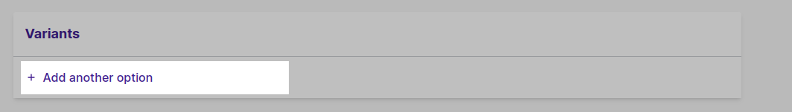
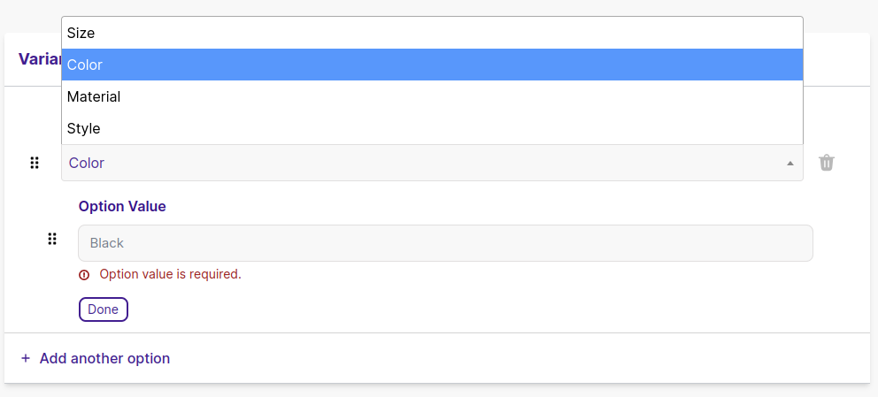
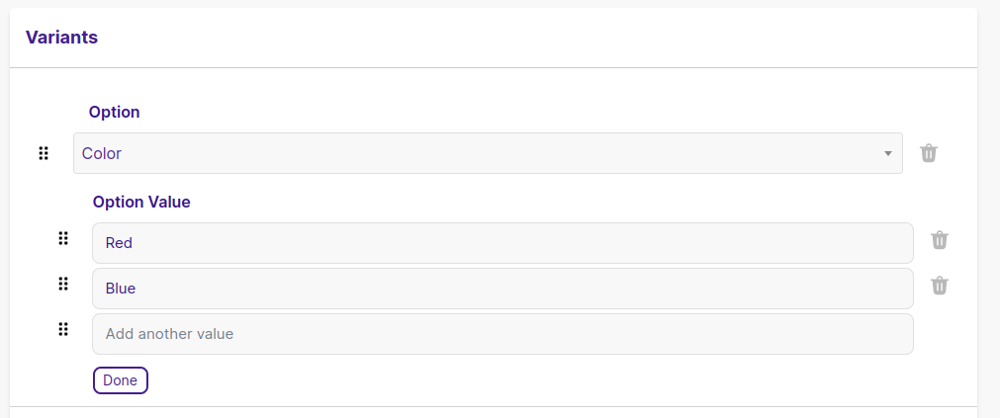
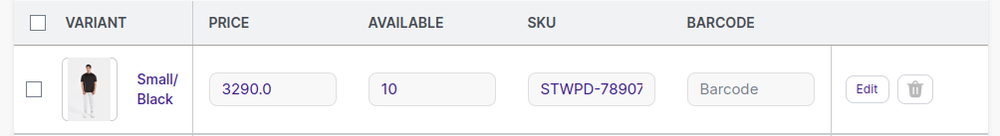
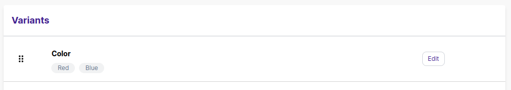

<head>
  <meta property="twitter:description" content="Add multiple variations for your product, such as size, color or material etc."/>
  <meta property="og:url" content="https://docs-becomy.surge.sh/products/details/"/>
  <link rel="canonical" href="https://docs-becomy.surge.sh/products"/>
  <link rel="alternate" href="https://docs-becomy.surge.sh/products/fr" hreflang="fr"/>
</head>


Product variants refer to the different versions or options available for a particular product.
These variants can include various attributes such as size, color, style, material, or any other characteristic
that can be customized or chosen by the customer. For example, in apparel, a t-shirt may have variants such as different
sizes (small, medium, large) and colors (black, white, blue).

Variants are helpful in many ways for both businesses and customers. Firstly, they allow businesses to assign different
images for each set of options a product has. This helps customers to visualize the different variations of the product,
making it easier for them to make a choice.

Secondly, variants enable businesses to adjust prices depending on the options selected. For instance, a larger size or a
premium material may have a higher price compared to smaller sizes or standard materials. This flexibility in pricing caters
to different customer preferences and budgets.

Lastly, variants help businesses track inventory for each variant separately. By assigning unique SKUs (Stock Keeping Units) to each variant,
businesses can monitor the available quantity of each option. This helps prevent overselling and ensures that customers can purchase the desired
variant without encountering stock shortages.

In summary, product variants offer customers a range of choices, enable businesses to customize pricing and visuals, and streamline
inventory management to provide a smoother shopping experience for all involved.


## Add Product Variants

You can add variants for a product having more than one option, such as color, size or material.

When you add a product, you can adjust it's shipping and inventory on product details page. However, when you add variants for a product, you need to
update the variant inventory or shipping from variant details page.

#### Steps

1. Navigate to the **Catalog -> Products**.

2. Either create a new product or select an existing one that you want to add variants to. Products that come in different options such as ```colors```, ```sizes```, or ```materials``` work best for this.

3. Within the product details, locate the **Variants** section and click + **Add Another Option**.



4. In the provided field, type in the name of the option you want to include, such as ```Size```, ```Color```, ```Style```, or ```Material```. For now you can only select 3 variant options. These names will be visible to your customers.



5. For each option, like ```Color``` for example, input the available values. For instance, ```Red```, ```Blue```. You can add as many option values for each option. These values will appear for customers to choose from when selecting the variant.


:::tip

If your product has only one option such as **color** and this option has more than one value (for example color Red and color Green). You can also create variantions for it. In this way
every option will be a separate variant having it's own stock, SKU, weight, Barcode and image.

:::

6. If you have more options to add, simply click + **Add Another Option** and repeat the process for each additional option you want to include. Just remember to keep it clear and concise for your customers to understand their choices easily.

7. Set the ```Price```, ```SKU```, ```available quantity``` and ```Barcode``` for the variation.



:::info

When generating variants against option and option values, **Variant SKU** is generated automatically based on the product title, options and option values you define.
Please remember **SKU** should be _unique_. If you keep the SKU empty by default, it won't let you set the variants.

:::


8. Click **Save**.


### Add Values to Existing Options for Product Variants

If you have already created a product with variants, then you can easily add new values for it to quickly generate new variant combination.

For instance, if you have variant with three sizes i.e ```Small```, ```Medium```, ```Large``` and 2 colors i.e ```Blue``` and ```Orange```, and you want to add third color ```Green```, then this will create
three sizes of Green variants at one time.

#### Steps

1. Navigate to the **Catalog -> Products**.

2. Choose the product that already has options set up, or the one you want to modify.

3. Scroll down to the **Variants** section within the product details and find the option you want to add values to, such as ```Size```, ```Color```, or ```Material```.



4. Click on the edit button of respective option section and reveal the existing values, if any.


5. To add a new optionvalue, simply press ```enter``` or move on to next field manually.

6. Type in the name of the new value in the provided field. For instance, if you're adding a new ```color``` option, you might input ```Extra Large```.

7. Click ```Done``` to collapse the section.

8. Update the ```Price```, ```SKU```, ```available quantity``` and ```Barcode``` and a different image for the variation.

9. Click **Save**.

Your customers will now be able to see and select these new values when choosing the product variant.


## Update Variants for an Existing Product

You can edit or remove variants of a product from product details page. This gives you feasibility in managing variants for your product.
You can update variant options and values, select variants to edit in bulk or alternatively you can navigate the variant details page to edit specific variant individually.

### Edit Variant Individually On Variant Details Page

You can edit your variant independently on variant details page.

1. From your Becomy Admin go to **Catalog -> Products**.

2. Click the Product for which you want to edit variants.

3. In the **variants** section, click on the title of variant you want to edit.

4. On **Variant Details Page**, edit variant details such as images, pricing, SKU, barcode, inventory and shipping.

:::info

You can only upload an image for an **existing variant**; uploading an image for a variant that hasn't been saved in the product yet is not supported.

:::

### Edit variant details in bulk

You can change the details of variants from variants details page. To edit the details for mutiple variants at once use bulk editor. For guide on how to use
bul editor refer to **bulk editing variants**.

### Edit Variant Options and Values


To manage variant options and values, follow these steps:

1. From your Becomy Admin, navigate to **Catalog -> Products**.

2. Click on the product for which you want to edit variant options and values.

3. In the **Variants** section, click on the **More options** button (represented by three dots) and select **Edit options**.

4. Here, you can add, edit, or remove variant options. To add a new option, click on **Add option** and type in the name of the option (for example, "Size" or "Color"). You can also specify the values for this option in the provided field.

5. To edit an existing option, click on the option name and make your changes. You can change the option name or its values.

6. To remove an option, click on the **Delete** button next to the option name.

7. Once you're done making changes, click **Done**.

8. Remember to click **Save** to apply your changes.

:::note

When you add or remove variant options, new variants are automatically created or removed based on the combinations of option values. Make sure to update the details (such as price, SKU, and inventory) for these new variants.

:::


### Rearrange the Order of Variant Options and Values

To rearrange the order of variant options and values, you can use the drag and drop feature. This allows you to customize the display order of your variant options according to your preference. Here's how you can do it:

1. From your Becomy Admin, navigate to **Catalog -> Products**.

2. Click on the product for which you want to rearrange variant options and values.

3. In the **Variants** section, locate the variant options.

4. Click and hold the option you want to move. Drag it to your desired position and release your hold to drop it in place.

5. Repeat this process for any other variant options or values you want to rearrange.

6. Once you're done rearranging, remember to click **Save** to apply your changes.

This way, you can easily change the order of your variant options and values to better suit your needs.

### Delete a Variant

To delete a variant from your Becomy store, follow these steps:

1. From your Becomy Admin, navigate to **Catalog -> Products**.

2. Click on the product that has the variant you want to delete.

3. In the **Variants** section, locate the variant you want to delete.

4. Click **delete** on variant you want to delete.

5. You can also undo delete if you haven't saved the changes by clicking the **undo** button.

5. Click on

:::note
Deleting a variant is permanent and cannot be undone. Make sure you want to delete the variant before confirming.
:::


### Search and Filter Variants by Option and Option Values

To make managing your product variants easier, you can search and filter variants by their options and option values. As you add new options, a list of filters is automatically generated. Here's how you can use these filters:

1. From your Becomy Admin, navigate to **Catalog -> Products**.

2. Click on the product that has the variants you want to filter.

3. In the **Variants** section, locate the **Filter** field.

4. Click on the **Filter** field to display the list of available filters. These filters correspond to the options and option values of your variants.

5. Select the option or option value you want to filter by. The list of variants will automatically update to display only the variants that match your selected filter.

6. To remove a filter, simply click on the **x** next to the filter name in the **Filter** field.

By using these filters, you can quickly and easily find specific variants, making it easier to manage your product variants.
