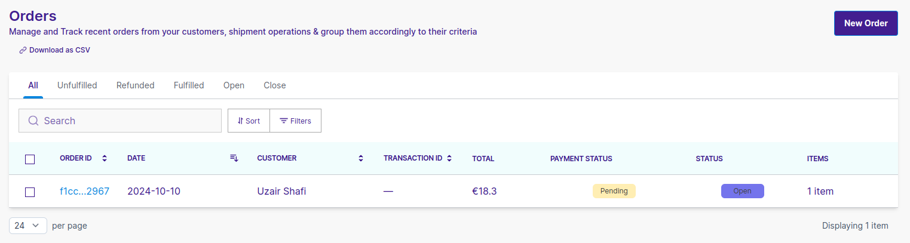
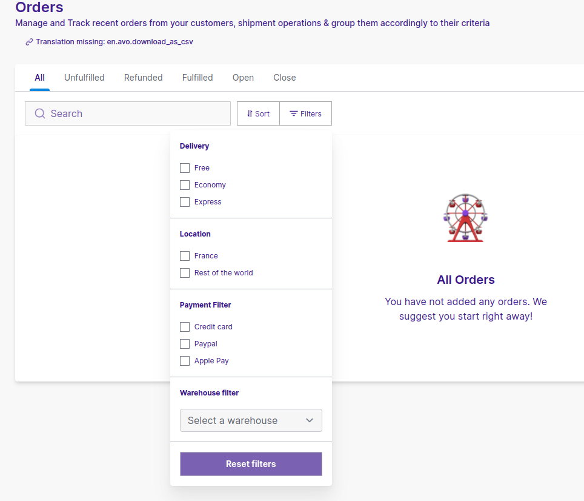
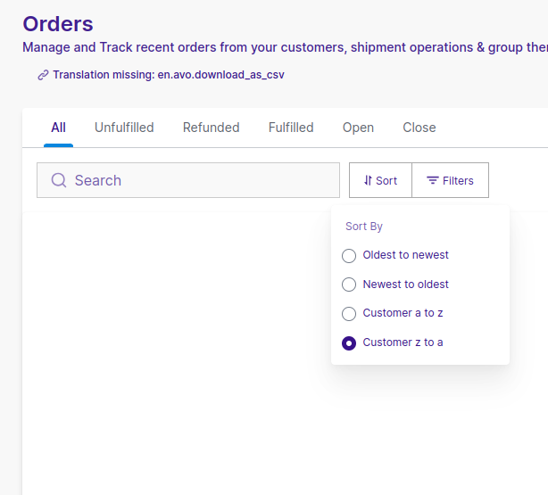

import useBaseUrl from "@docusaurus/useBaseUrl";

<head>
  <meta
    property="twitter:description"
    content="Learn all about how you can view and filter your orders in admin dashboard."
  />
  <meta
    property="og:url"
    content="https://docs-becomy.surge.sh/orders/searching-and-viewing/"
  />
  <link rel="canonical" href="https://docs-becomy.surge.sh/orders" />
  <link
    rel="alternate"
    href="https://docs-becomy.surge.sh/orders/fr"
    hreflang="fr"
  />
</head>

# Searching and Viewing Orders

By default, all your orders are displayed on the Orders page. You can customize your order views or create new ones that include filters and sorting, making it easier to quickly access and prioritize groups of orders in the future.

## Viewing details from the orders list

You can sort orders or apply different available filters in order to see specific orders based on that filters or sorting method.

### Filter your orders

Filters determine which orders are displayed in an order view. For instance, the **All** view has no filters. The default **Unfulfilled** view uses the **Fulfillment status** filter set to "unfulfilled" to show all unfulfilled orders in your store.

You can also combine filters to display orders that match multiple criteria. For example, you can combine the **open** and **Unfulfilled** filters to see orders that are both low risk and unpaid.

### Available filters

You can apply the following filters on your order list:

- **Delivery Method**: local delivery, pickup in-store, ship to customer
- **LOcation**: continent, country, state/province where the order will be shipped
- **Status**: open, closed.
- **Payment status**: authorized, paid, partially paid, partially refunded, pending, refunded, unpaid, voided
- **Fulfillment status**: fulfilled, unfulfilled, refunded, scheduled, on hold
- **Delivery status**: in transit, out for delivery, attempted delivery, delayed, failed delivery, delivered, tracking added, no status
- **Date**: in the last week, month, 3 months, year, or custom
- **Payment method**: which payment method is being used for this order
- **WArehouse**: if you have multiple warehouses then you can also filter orders on base of specific warehouse.

### Available Sorting Methods

You can apply the following sorting methods on your order list:

- **oldest to newest**
- **newest to oldest**
- **alphabetically from a to z**
- **alphabetically from z to a**

## Order views

An order view is a customized display of orders based on the criteria you set to make tasks easier. Order views are created using saved filters, column choices, column order, and sort order. Order views appear as tabs at the top of the Orders page. You can customize, create, rename, or delete these views. When a new order view is created, it’s added as a new tab on the Orders page.

### Default order views:

- **All**
- **Unfulfilled**
- **Fulfilled**
- **Refunded**
- **Open**
- **Closed**

If **Location** is activated for your store, a **Local Delivery** view is also available.

In any view except **All**, you can:

- Select filters
- Choose sorting criteria and sorting order
- choose any of the filters

Orders in saved views are updated automatically. For instance, if you saved a filter for **fulfilled** orders, any orders that are fulfilled afterward will automatically appear in that view.
