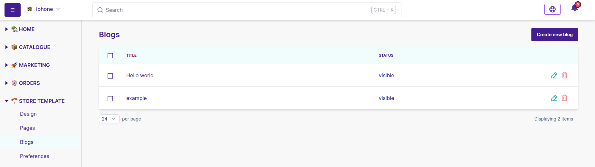
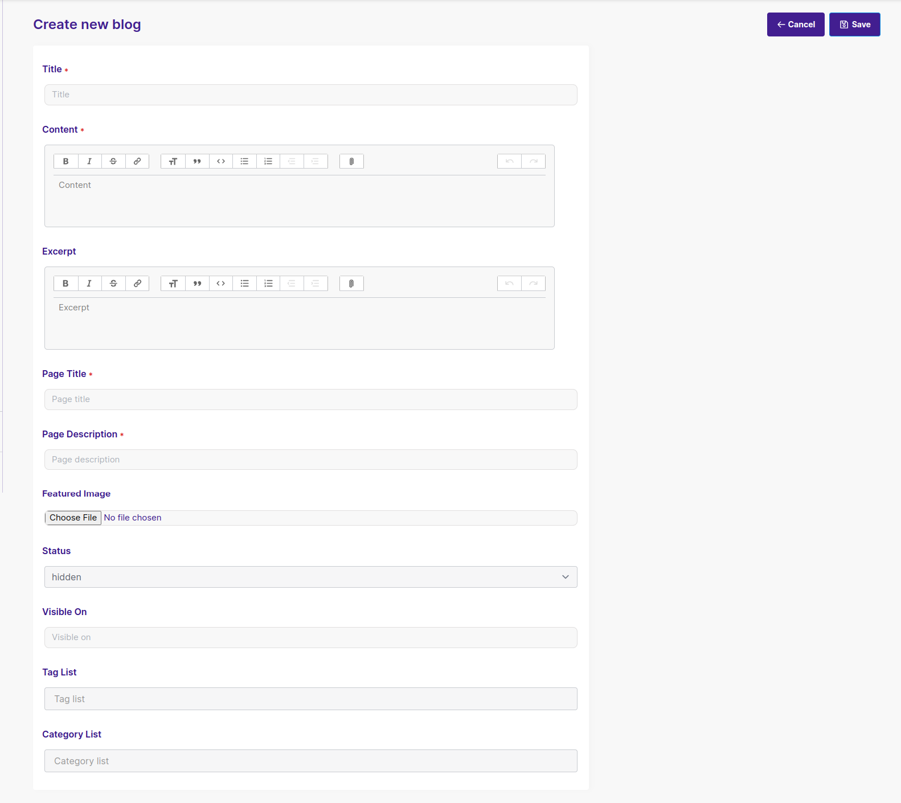

import useBaseUrl from "@docusaurus/useBaseUrl";
import { Table } from "@site/src/components/DataTable";

<head>
  <meta
    property="twitter:description"
    content="Learn all about setting up blogs on your store."
  />
  <meta
    property="og:url"
    content="https://docs-becomy.surge.sh/store_template/blogs/"
  />
  <link rel="canonical" href="https://docs-becomy.surge.sh/store_template" />
  <link
    rel="alternate"
    href="https://docs-becomy.surge.sh/store_template/fr"
    hreflang="fr"
  />
</head>

# Managing Blogs on Becomy

Becomy provides a comprehensive blogging tool that allows you to create, organize, and publish content directly from your Becomy admin dashboard. This feature is designed to help you share updates, insights, and stories with your audience, enhancing engagement and driving traffic to your store.

## Setting Up Your Blog

To begin creating blog posts, navigate to your **`Becomy Admin Dashboard`** and open the **`Store Template`** tab. Under this tab, select **`Blogs`** to access the blogs section.

## Creating a New Blog Post

- **Create New Blog**: In the Blogs section, click on the "`Create New Blog`" button located in the top-right corner. This will open a powerful text editor that allows you to write, format, and edit your blog content with ease.
- **Craft Your Content**: Use the editor to write your blog posts, add images, relevant `tags` and format your blog description text to match your brand’s voice and style.
- **Organize by Category**: To make it easy for readers to find relevant content, `categorize` your posts as you create them. This organization helps improve navigation and enhances your audience's experience on your site.

## Viewing, Editing, and Deleting Blog Posts

Once you’ve created blog posts, managing them is straightforward from your Becomy dashboard.

- **Viewing Blog Posts**: Access all published blog posts in the **`Blogs`** section of your dashboard. Each post is listed with a preview, title, and publishing status, allowing you to quickly find and manage your content.

- **Editing Blog Posts**: To make changes to an existing post, click on the `edit icon` to open it in the editor. Here, you can modify the content, add or adjust images, and update categories. Once your changes are complete, save the post to apply the updates.

- **Deleting Blog Posts**: If you need to remove a blog post, locate the post in the **Blogs** section and click on the `Delete icon`. A confirmation prompt will appear to ensure you wish to proceed. `Confirm the deletion` to permanently remove the post from your store.

This streamlined management process allows you to keep your blog content up-to-date and relevant for your audience, enhancing their experience with your brand.
