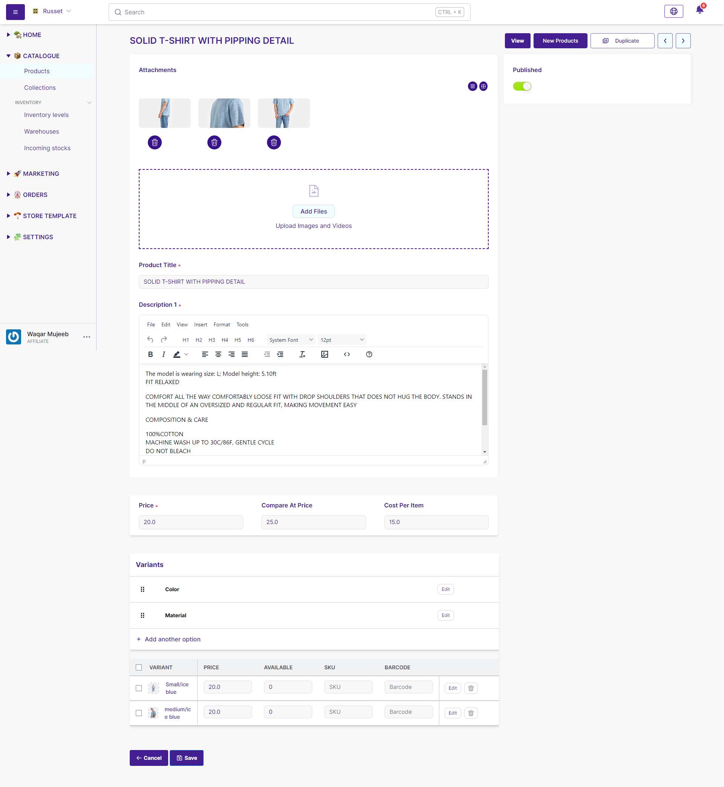

<head>
<meta property="twitter:description" content="Obtenez des informations sur la gestion du titre, de la description, des médias du produit et des variantes sur notre page de détails du produit pour une vue d'ensemble complète"/>
<meta property="twitter:title" content="Product details | Becomy"/>
<meta property="og:url" content="https://docs-becomy.surge.sh/products/details/"/>
<link rel="canonical" href="https://docs-becomy.surge.sh/products"/>
<link rel="alternate" href="https://docs-becomy.surge.sh/products/fr" hreflang="fr"/>
</head>

## Guide des détails du produit

Les informations que vous partagez concernant vos produits ont un impact direct sur la manière dont ils apparaissent à vos clients, facilitant ainsi la gestion de vos produits et aidant les clients à trouver le produit souhaité. Vous n'avez pas besoin de donner tous les détails de votre produit. Pour créer un produit, vous devez spécifier des détails pertinents tels que le titre, la description et télécharger des images du produit. De plus, vous pouvez ajouter des détails qui aident vos clients à comprendre facilement le produit. Ajoutez le prix, les variantes le cas échéant, le poids et les détails d'expédition.  
Pour mettre à jour les images des variantes de produit, accédez à la section des variantes sur la page du produit. Après la création du produit, accédez à la page spécifique du produit depuis la liste des produits et mettez à jour les images des variantes là-bas. 
Cela permet une personnalisation facile et une gestion des images de variantes, garantissant à chaque variante une représentation visuelle distincte.

### Titre et Description

- **Titre**: Le nom que vous souhaitez afficher pour votre produit. Vous pouvez inclure les informations cruciales sur le produit pour faciliter la compréhension par les clients.

- **Description**: Description de votre produit. Mettez l'accent sur les avantages du produit, mettez en évidence les caractéristiques du produit et énumérez ses caractéristiques. Vous pouvez également utiliser des éléments animés, des images pour aider à décrire votre produit.
La section de description utilise l'[éditeur de texte enrichi](#), vous permettant d'utiliser facilement des puces, des listes numérotées, des paragraphes, des liens ou des images supplémentaires.

:::tip

Évitez d'utiliser les descriptions exactes du fabricant pour garantir l'unicité dans les moteurs de recherche.

:::

### Médias

Incluez des images, des modèles 3D et des vidéos pour présenter votre produit. Consultez [Médias du produit](#) pour des informations détaillées.

### Tarification

- **Prix**: Définissez le prix du produit dans la devise de votre magasin.
- **Prix de comparaison**: Prix d'origine d'un produit en vente.
- **Coût par article**: Champ facultatif pour le coût de production. Affiche la marge prévue.

*Remarque*: Les changements de tarification peuvent avoir un impact sur les rapports. Consultez [Tarification des produits](https://becomystaging.com/pricing) pour plus de détails.

### Inventaire

- **SKU (Stock Keeping Unit)**: Code unique pour l'identification du produit.
- **Code-barres (ISBN, UPC, GTIN)**: Codes-barres pour un suivi efficace et des rapports de vente.
- **Disponible**: Unités en stock.
- **Entrant**: Nombre d'unités entrantes.
- **Engagé**: Unités faisant partie d'une commande mais non encore traitées.

*Astuce*: Utilisez l'éditeur en masse ou l'importation CSV pour des mises à jour efficaces. Les produits de cartes-cadeaux sont exemptés du coût par article.

### Expédition

- **Ce produit nécessite une expédition**: Sélectionnez pour les produits physiques.
- **Poids**: Poids exact du produit pour le calcul des frais d'expédition.
- **Ajouter des informations douanières**: Enregistrez les informations pour l'expédition internationale.

*Remarque*: Un poids précis est crucial pour les tarifs d'expédition. Les informations douanières sont nécessaires pour l'expédition internationale. [En savoir plus](#)

### Catégorie

- **Catégorie**: Étiquette décrivant le groupe de produits. Utilise la taxonomie des produits Becomy.
- **Méta-champs de catégorie**: Attributs supplémentaires et entrées par défaut débloqués en attribuant une catégorie de produit.

*Accès anticipé*: Nouvelle taxonomie des produits et méta-champs de catégorie en accès anticipé. Postulez via l'édition [Hiver '24](#).

### Variantes

Explorez les options de produits telles que la couleur et la taille. Consultez [Variantes](#) pour des informations détaillées.

### Options d'achat

Ajoutez des options d'achat telles que les abonnements, les essais avant achat et les précommandes. En savoir plus sur les [Options d'achat](#).

### Référencement

Prévisualisez comment votre produit s'affichera dans les résultats des moteurs de recherche. Cliquez sur 'Modifier' dans la section de la liste de moteurs de recherche pour apporter des modifications.

### Statut du produit

- **Actif**: Détails du produit complets et prêts à la vente.
- **Brouillon**: Détails du produit incomplets.
- **Archivé**: Détails complets, mais le produit n'est pas en vente.

*Remarque*: Certains statuts peuvent être affichés pour les magasins soumis à des avis de propriété intellectuelle.

### Publication

Affiche une liste de canaux de vente et de marchés. Gérez la publication via [Gestion de la publication](#).

### Organisation

- **Type de produit**: Catégorie personnalisée pour un produit.
- **Fournisseur**: Fabricant, grossiste ou fournisseur du produit.
- **Collections**: Collections auxquelles le produit est inclus.
- **Tags**: Mots-clés recherchables associés au produit.

### Boutique en ligne

Affiche le modèle de produit actuel. Par défaut, il s'agit du 'Modèle de produit par défaut'. En savoir plus sur les [Modèles de thème](#).

### Ajout d'informations spécialisées avec les méta-champs de produit

Ajoutez des champs personnalisés avec des méta-champs pour des informations spécialisées. Connectez les méta-champs à votre thème en utilisant l'éditeur de thème.

*Remarque*: Les thèmes de la boutique en ligne 2.0, tels que Dawn, prennent en charge les méta-champs. Modifiez le code du thème ou engagez un partenaire Becomy pour les autres thèmes.

Ce guide complet couvre tous les détails nécessaires pour créer et gérer des produits sur la plateforme de commerce électronique Becomy SAAS. Pour un soutien supplémentaire, consultez les sujets connexes ou contactez notre service client