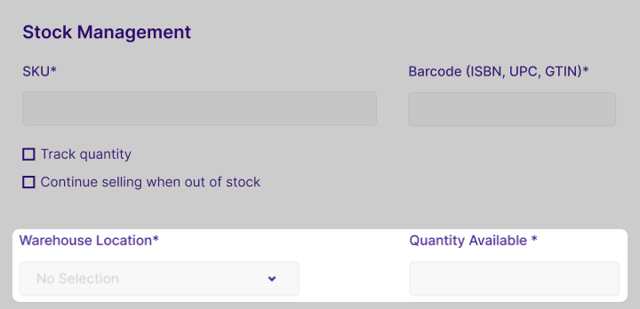

<head>
<meta property="twitter:description" content="Obtenez des informations sur la gestion du titre, de la description, des médias du produit et des variantes sur notre page de détails du produit pour une vue d'ensemble complète"/>
<meta property="twitter:title" content="Product details | Becomy"/>
<meta property="og:url" content="https://docs-becomy.surge.sh/products/details/"/>
<link rel="canonical" href="https://docs-becomy.surge.sh/products"/>
<link rel="alternate" href="https://docs-becomy.surge.sh/products/fr" hreflang="fr"/>
</head>

## Guide des détails du produit

Vous pouvez facilement gérer vos produits et aider les clients à trouver ce qu'ils recherchent en partageant des informations à leur sujet qui affectent directement leur apparence. Vous n'avez pas besoin de fournir tous les détails sur votre produit.

Pour créer un produit, vous devez fournir les informations nécessaires telles que le titre, la description et soumettre des photos du produit. Vous devez inclure des informations qui rendent votre produit plus facile à comprendre pour vos clients. Ajoutez le prix, les variations éventuelles, le poids et les informations d'expédition.

Pour mettre à jour les photos des variantes de produits, accédez à la section des variantes de la page du produit. Après avoir créé le produit, allez à la page du produit pertinente dans la liste des produits et mettez à jour les images des variantes.

Cela permet une personnalisation facile et une gestion des images de variantes, garantissant à chaque variante une représentation visuelle distincte.

### Titre et description

- **Titre** : Le nom que vous souhaitez afficher pour votre produit. Vous pouvez inclure des informations cruciales sur le produit pour le rendre plus facile à comprendre pour les clients.
- **Description** : Description de votre produit. Mettez l'accent sur les avantages du produit, mettez en évidence les caractéristiques du produit et énumérez ses caractéristiques. Vous pouvez également utiliser des éléments animés, des images pour aider à décrire votre produit. La section de description utilise l'[éditeur de texte enrichi](#), vous pouvez donc facilement utiliser des puces, des listes numérotées, des paragraphes, des liens ou des images supplémentaires.

:::tip

Évitez d'utiliser les descriptions exactes du fabricant pour l'unicité dans les moteurs de recherche. Consultez l'[éditeur de texte enrichi](#) pour plus de détails.

:::

### Médias

Incluez des images, des modèles 3D et des vidéos pour présenter votre produit. Reportez-vous à [Médias du produit](#) pour des informations détaillées.

### Tarification

Vous pouvez définir des prix pour les variations de produits et les produits individuels. Établir des prix pour les produits implique le calcul des coûts de production, l'ajout de bénéfices souhaités et la prise en compte de la demande du marché. Une analyse concurrentielle garantit que les prix sont alignés sur les normes de l'industrie, tandis que des remises stratégiques et des options de regroupement peuvent améliorer les ventes et l'attrait client.

- **Prix** : Définissez le prix du produit dans la devise de votre magasin.
- **Prix de comparaison** : C'est le prix réel ou d'origine auquel le produit est vendu. Pour définir le **Prix de comparaison** pour le produit.
    1. Depuis votre administration Becomy, allez à **Catalogue -> Produits**
    2. Consultez le produit pour lequel vous souhaitez définir le **Prix de comparaison**.
    3. Faites défiler jusqu'à la section Tarification.
    4. Définissez le prix dans le champ de saisie **Prix de comparaison**. La valeur doit être supérieure à celle du champ **Tarification**.
      
      
    
    5. Enregistrez les modifications.
- **Coût par article** : Champ facultatif pour le coût de production. Affiche la marge projetée.

      

### Inventaire

L'inventaire est la quantité de produits disponibles à la vente.

Il est crucial de suivre vos produits dans votre inventaire afin de ne pas vendre plus que ce que vous avez réellement. Cela vous aide à vous rappeler de réapprovisionner votre stock avant qu'il ne soit épuisé et montre également les produits disponibles à vos clients.

#### SKU

SKU (Stock Keeping Unit) est un code d'identification du produit au sein de votre entreprise. Pour un suivi efficace des produits, chaque SKU doit être unique. C'est soit votre propre mélange de lettres ou de chiffres, soit fourni par le fabricant. Le champ SKU est facultatif, s'il est vide, le produit n'aura pas de SKU, mais s'il en a un, il doit être unique.

:::info
Si vous souhaitez vendre un produit avec plusieurs variations, vous pouvez ajouter des SKUs pour chaque variation.
:::

#### Code-barres

Le code-barres (GTIN, ISBN, UPC) est un code spécial pour afficher des informations sur les produits. Ce code aide à identifier et à suivre rapidement les produits, facilitant la gestion des stocks. Il peut s'agir d'un nouveau numéro mondial d'article commercial ou existant, utilisé à l'échelle mondiale pour identifier les produits. Selon le produit, le GTIN, l'ISBN et l'UPC peuvent varier en longueur. S'il vous plaît, ne pas écrire de faux code-barres pour vos produits.
Si vous n'avez pas de code-barres pour le produit, vous pouvez l'obtenir auprès du fabricant. Identifiez comment obtenir le GTIN de votre produit auprès du fabricant sur [Site Web de la norme GS1 <Icon icon="fa-solid fa-arrow-up-right-from-square" />](https://www.gs1.org/standards/barcodes)

:::info
Vous pouvez ajouter un code-barres pour chaque variation du produit séparément.
:::

#### Emplacement de l'entrepôt et disponibilité

Le champ **Disponible** indique la quantité d'un produit en stock. Spécifiez la quantité disponible de produits lors de la création du produit. Si vous vendez des variations du même produit, vous pouvez déclarer la quantité disponible pour chaque variation.
De plus, si votre stock est dans différents endroits, ajoutez les emplacements dans le champ **Emplacement de l'entrepôt** et le nombre d'articles dans chaque endroit.

:::info
Pour ajouter de nouveaux emplacements d'entrepôt, accédez à [**Inventaire -> Entrepôts** <Icon icon="fa-solid fa-arrow-up-right-from-square" />](https://becomystaging.com/admin/resources/warehouses)
:::

### Expédition

La section Expédition et Retrait sur Becomy vous aide à configurer la manière dont vos produits physiques atteindront vos clients. Cela inclut la désignation des produits comme expédiables, la configuration de méthodes d'exp

{/* ### Statut du produit

- **Actif**: Détails du produit complets et prêts à la vente.
- **Brouillon**: Détails du produit incomplets.
- **Archivé**: Détails complets, mais le produit n'est pas en vente.

*Remarque*: Certains statuts peuvent être affichés pour les magasins soumis à des avis de propriété intellectuelle.

### Publication

Affiche une liste de canaux de vente et de marchés. Gérez la publication via [Gestion de la publication](#).

### Organisation

- **Type de produit**: Catégorie personnalisée pour un produit.
- **Fournisseur**: Fabricant, grossiste ou fournisseur du produit.
- **Collections**: Collections auxquelles le produit est inclus.
- **Tags**: Mots-clés recherchables associés au produit.

### Boutique en ligne

Affiche le modèle de produit actuel. Par défaut, il s'agit du 'Modèle de produit par défaut'. En savoir plus sur les [Modèles de thème](#).

### Ajout d'informations spécialisées avec les méta-champs de produit

Ajoutez des champs personnalisés avec des méta-champs pour des informations spécialisées. Connectez les méta-champs à votre thème en utilisant l'éditeur de thème.

*Remarque*: Les thèmes de la boutique en ligne 2.0, tels que Dawn, prennent en charge les méta-champs. Modifiez le code du thème ou engagez un partenaire Becomy pour les autres thèmes.

Ce guide complet couvre tous les détails nécessaires pour créer et gérer des produits sur la plateforme de commerce électronique Becomy SAAS. Pour un soutien supplémentaire, consultez les sujets connexes ou contactez notre service client */}