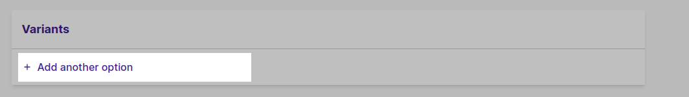
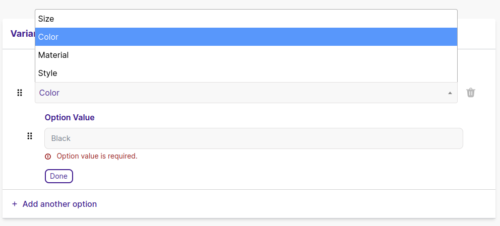
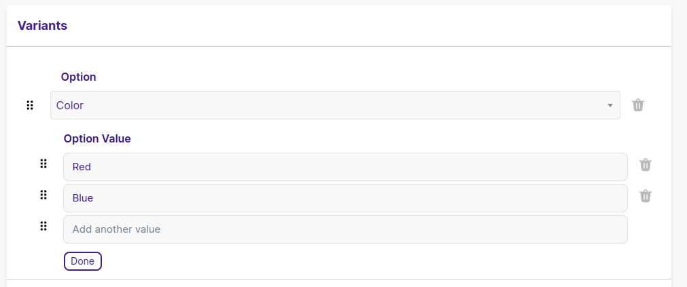
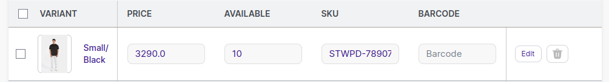

<head>
<meta property="twitter:description" content="Ajoutez plusieurs variations pour votre produit, telles que la taille, la couleur ou le matériau, etc."/>
<meta property="og:url" content="https://docs-becomy.surge.sh/products/details/"/>
<link rel="canonical" href="https://docs-becomy.surge.sh/products"/>
<link rel="alternate" href="https://docs-becomy.surge.sh/products/fr" hreflang="fr"/>
</head>


Les variantes de produit font référence aux différentes versions ou options disponibles pour un produit particulier. Ces variantes peuvent inclure divers attributs tels que la taille, la couleur, le style, le matériau ou toute autre caractéristique pouvant être personnalisée ou choisie par le client. Par exemple, dans l'habillement, un t-shirt peut avoir des variantes telles que différentes tailles (petit, moyen, grand) et couleurs (noir, blanc, bleu).

Les variantes sont utiles de plusieurs façons pour les entreprises et les clients. Premièrement, elles permettent aux entreprises d'attribuer différentes images pour chaque ensemble d'options qu'un produit possède. Cela aide les clients à visualiser les différentes variations du produit, ce qui facilite leur choix.

Deuxièmement, les variantes permettent aux entreprises d'ajuster les prix en fonction des options sélectionnées. Par exemple, une taille plus grande ou un matériau premium peuvent avoir un prix plus élevé par rapport aux tailles plus petites ou aux matériaux standard. Cette flexibilité dans la tarification répond aux différentes préférences et budgets des clients.

Enfin, les variantes aident les entreprises à suivre les stocks pour chaque variante séparément. En attribuant des unités de gestion des stocks (SKU) uniques à chaque variante, les entreprises peuvent surveiller la quantité disponible de chaque option. Cela aide à éviter les surventes et garantit que les clients peuvent acheter la variante désirée sans rencontrer de pénuries de stock.

En résumé, les variantes de produit offrent aux clients une gamme de choix, permettent aux entreprises de personnaliser les prix et les visuels, et rationalisent la gestion des stocks pour offrir une expérience d'achat plus fluide à tous les acteurs concernés.


## Ajouter des Variantes de Produit

Vous pouvez ajouter des variantes pour un produit ayant plus d'une option, telle que la couleur, la taille ou le matériau.

Lorsque vous ajoutez un produit, vous pouvez ajuster son expédition et son inventaire sur la page des détails du produit. Cependant, lorsque vous ajoutez des variantes pour un produit, vous devez mettre à jour l'inventaire ou l'expédition de la variante depuis la page des détails de la variante.

#### Étapes

1. Accédez à **Catalogue -> Produits**.

2. Créez un nouveau produit ou sélectionnez-en un existant auquel vous souhaitez ajouter des variantes. Les produits qui viennent avec différentes options telles que ```couleurs```, ```tailles```, ou ```matériaux``` fonctionnent le mieux pour cela.

3. Dans les détails du produit, localisez la section **Variantes** et cliquez sur + **Ajouter une Autre Option**.



4. Dans le champ fourni, saisissez le nom de l'option que vous souhaitez inclure, telle que ```Taille```, ```Couleur```, ```Style```, ou ```Matériau```. Pour l'instant, vous ne pouvez sélectionner que 3 options de variantes. Ces noms seront visibles pour vos clients.



5. Pour chaque option, comme ```Couleur``` par exemple, saisissez les valeurs disponibles. Par exemple, ```Rouge```, ```Bleu```. Vous pouvez ajouter autant de valeurs d'option pour chaque option. Ces valeurs apparaîtront pour les clients à choisir lors de la sélection de la variante.


:::tip

Si votre produit n'a qu'une seule option telle que la **couleur** et que cette option a plus d'une valeur (par exemple couleur Rouge et couleur Vert). Vous pouvez également créer des variations pour cela. De cette façon, chaque option sera une variante séparée ayant son propre stock, SKU, poids, code-barres et image.

:::

6. Si vous avez d'autres options à ajouter, cliquez simplement sur + **Ajouter une Autre Option** et répétez le processus pour chaque option supplémentaire que vous souhaitez inclure. N'oubliez pas de le rendre clair et concis pour que vos clients comprennent facilement leurs choix.

7. Définissez le ```Prix```, le ```SKU```, la ```quantité disponible``` et le ```Code-barres``` pour la variation.



:::info

Lors de la génération de variantes par rapport à l'option et aux valeurs d'option, le **SKU de la variante** est généré automatiquement en fonction du titre du produit, des options et des valeurs d'option que vous définissez. Veuillez vous rappeler que le **SKU** doit être _unique_. Si vous laissez le champ SKU vide par défaut, il ne vous permettra pas de définir les variantes.

:::


8. Cliquez sur **Enregistrer**.

### Ajouter des Valeurs aux Options Existantes pour les Variantes de Produit

Si vous avez déjà créé un produit avec des variantes, vous pouvez facilement ajouter de nouvelles valeurs pour générer rapidement de nouvelles combinaisons de variantes.

Par exemple, si vous avez une variante avec trois tailles, c'est-à-dire ```Petit```, ```Moyen```, ```Grand``` et deux couleurs, c'est-à-dire ```Bleu``` et ```Orange```, et que vous voulez ajouter une troisième couleur ```Vert```, alors cela créera trois tailles de variantes Vertes en une seule fois.

#### Étapes

1. Accédez à **Catalogue -> Produits**.

2. Choisissez le produit qui a déjà des options configurées, ou celui que vous souhaitez modifier.

3. Faites défiler jusqu'à la section **Variantes** dans les détails du produit et trouvez l'option à laquelle vous souhaitez ajouter des valeurs, telle que ```Taille```, ```Couleur```, ou ```Matériau```.


4. Cliquez sur le bouton d'édition de la section d'option respective et révélez les valeurs existantes, le cas échéant.


5. Pour ajouter une nouvelle valeur d'option, appuyez simplement sur ```Entrée``` ou passez au champ suivant manuellement.

6. Tapez le nom de la nouvelle valeur dans le champ fourni. Par exemple, si vous ajoutez une nouvelle option de ```couleur```, vous pourriez saisir ```Extra Large```.

7. Cliquez sur ```Terminé``` pour fermer la section.

8. Mettez à jour le ```Prix```, le ```SKU```, la ```quantité disponible``` et le ```Code-barres``` ainsi qu'une image différente pour la variation.

9. Cliquez sur **Enregistrer**.

Vos clients pourront désormais voir et sélectionner ces nouvelles valeurs lors du choix de la variante du produit.


## Mettre à Jour les Variantes pour un Produit Existant

Vous pouvez modifier ou supprimer les variantes d'un produit à partir de la page des détails du produit. Cela vous donne la possibilité de gérer facilement les variantes de votre produit.
Vous pouvez mettre à jour les options et les valeurs des variantes, sélectionner les variantes à modifier en masse ou vous pouvez accéder à la page des détails de la variante pour modifier une variante spécifique individuellement.

### Modifier la Variante Individuellement Sur la Page des Détails de la Variante

Vous pouvez modifier votre variante indépendamment sur la page des détails de la variante.

1. Depuis votre Admin Becomy, accédez à **Catalogue -> Produits**.

2. Cliquez sur le Produit que vous souhaitez modifier les variantes.

3. Dans la section **variantes**, cliquez sur le titre de la variante que vous souhaitez modifier.

4. Sur la **Page des Détails de la Variante**, modifiez les détails de la variante tels que les images, les prix, le SKU, le code-barres, l'inventaire et l'expédition.

:::info

Vous ne pouvez télécharger une image que pour une **variante existante**; le téléchargement d'une image pour une variante qui n'a pas encore été enregistrée dans le produit n'est pas pris en charge.

:::

### Modifier les détails de la variante en masse
### Modifier les options et les valeurs de la variante
### Changer l'ordre d'affichage des options et des valeurs de la variante
### Modifier un métachamp pour une variante
### Supprimer une variante